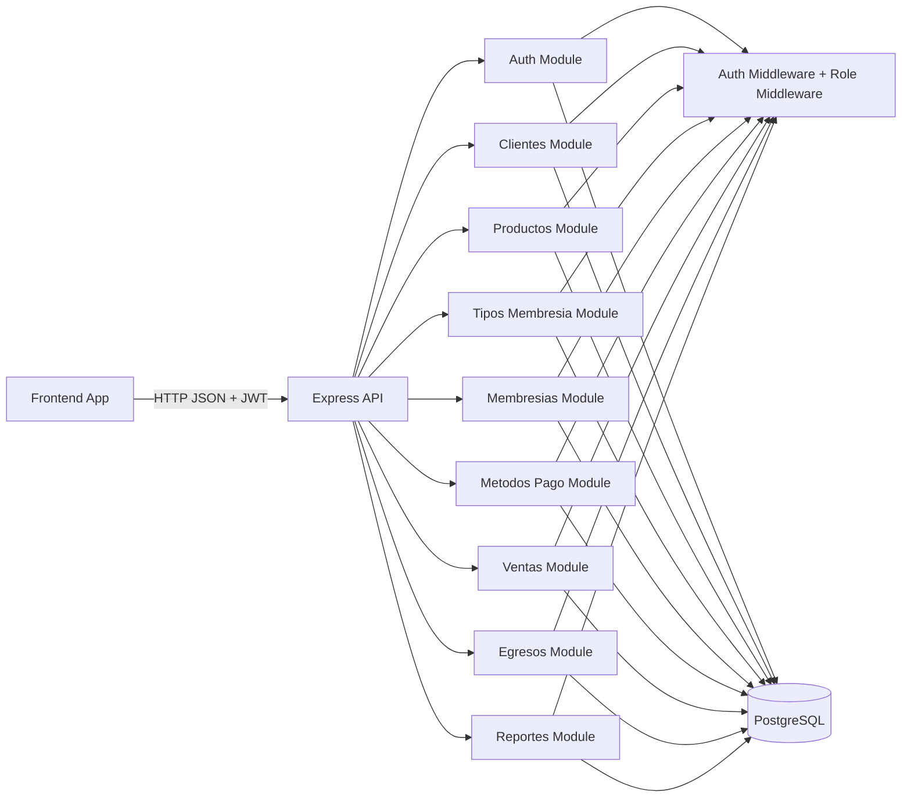
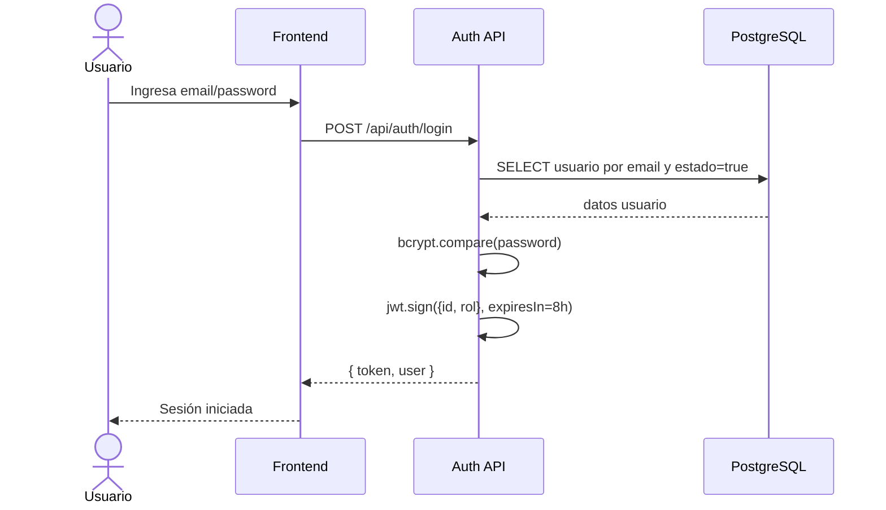
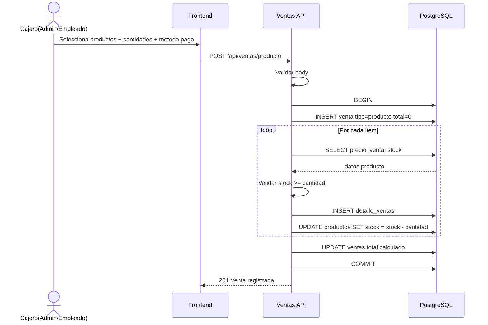
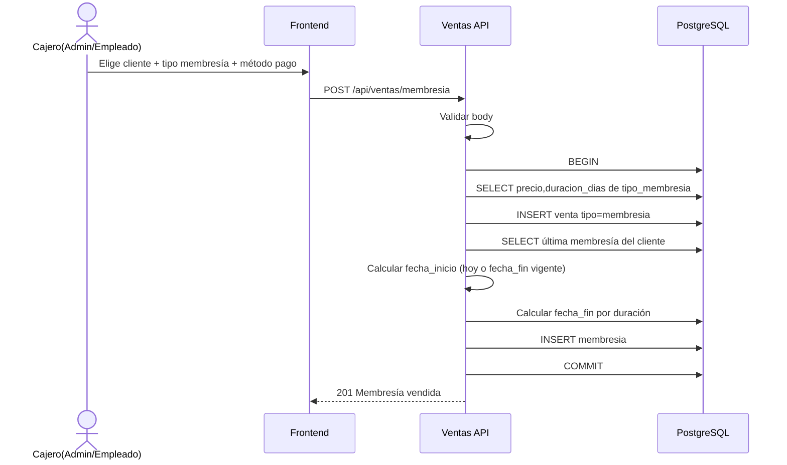
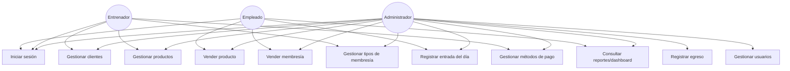

# Validación Integral de Lógica de Negocio - Gym Manager Backend

Fecha: 2026-03-24

## Resultado ejecutivo

Estado actual: **válido para avanzar al frontend**. Los bloqueadores de autorización y consistencia reportados inicialmente fueron corregidos.

Se validó:
- Estructura modular por dominio (auth, clientes, ventas, membresías, reportes, etc.).
- Consistencia general de consultas SQL parametrizadas (sin inyección SQL directa visible).
- Flujo transaccional en ventas de productos y membresías.
- Sintaxis JavaScript de todo `src/` (sin errores de parseo).

## Correcciones aplicadas

### 1) Catálogo de roles consistente
- Se agregó `EMPLEADO` en `src/utils/roles.js`.

### 2) Middleware de roles más robusto
- `checkRole` ahora soporta arreglo o valor único y valida usuario autenticado.
- Esto evita errores por uso accidental del middleware.

### 3) Rutas con permisos corregidos
- Se normalizaron llamadas a `checkRole([ ... ])` en rutas que estaban inconsistentes.
- Ventas y dashboard permiten `ADMIN` y `EMPLEADO`.

## Mejoras de consistencia aplicadas

### 4) Estandarización de 404
- Se agregó respuesta `404` cuando no existe recurso en controladores de productos, métodos de pago, egresos, clientes, membresías y tipos de membresía.

### 5) Validaciones de entrada más explícitas
- Se reemplazaron validaciones ambiguas por reglas numéricas explícitas en productos, ventas, egresos y tipos de membresía.
- Se agregaron mensajes de error más precisos para frontend.

### 6) Registro de usuarios endurecido
- Se validan roles permitidos al registrar usuario.
- Se agregó validación de unicidad de email con respuesta `409` si ya existe.

### 7) Bootstrap de DB seguro
- Se reemplazó `pool.connect()` por `pool.query('SELECT 1')` para comprobar conexión sin retener cliente.

## Lo que sí está bien

- Consultas SQL con placeholders (`$1, $2...`) en controladores.
- Transacciones en `venderProducto` y `venderMembresia` con `BEGIN/COMMIT/ROLLBACK`.
- JWT implementado y middleware de autorización centralizado.
- Separación modular por dominio y rutas limpias por recurso.
- `productos.routes` actualmente ya está protegido con autenticación y roles.

---

## Diagrama de arquitectura/lógica general

## Secuencia: Login

## Secuencia: Venta de producto

## Secuencia: Venta de membresía

## Casos de uso (resumen)

## Historias de usuario recomendadas para alinear Frontend

1. Como administrador, quiero iniciar sesión y obtener mi token para acceder a módulos protegidos.
2. Como administrador, quiero crear y administrar usuarios para delegar operaciones por rol.
3. Como entrenador, quiero consultar clientes y membresías para seguimiento de planes.
4. Como empleado, quiero registrar ventas de productos para actualizar caja e inventario.
5. Como empleado, quiero vender membresías para activar o extender vigencias.
6. Como administrador, quiero registrar egresos para controlar utilidades reales.
7. Como administrador, quiero ver dashboard diario/mensual para decidir acciones operativas.
8. Como administrador, quiero configurar tipos de membresía y métodos de pago.
9. Como administrador, quiero desactivar clientes sin perder histórico.

## Checklist pre-frontend

- [x] Corregir `roles.js` agregando `EMPLEADO`.
- [x] Corregir llamadas a `checkRole` y endurecer middleware.
- [x] Mantener protegidas rutas de productos con `verifyToken + checkRole`.
- [x] Estandarizar 404 cuando el recurso no exista.
- [x] Ajustar validaciones numéricas por regla de negocio (`>0`, `>=0`).
- [x] Validar unicidad de email en registro.
- [ ] Confirmar constraints en DB (FK y checks en esquema SQL, fuera de código Node).

## Conclusión

El backend quedó consistente para iniciar frontend: autorización corregida, validaciones más claras, manejo de errores homogéneo y flujo transaccional de ventas intacto. El siguiente punto recomendado es blindar el esquema de base de datos con constraints para cerrar la validación de negocio de extremo a extremo.
